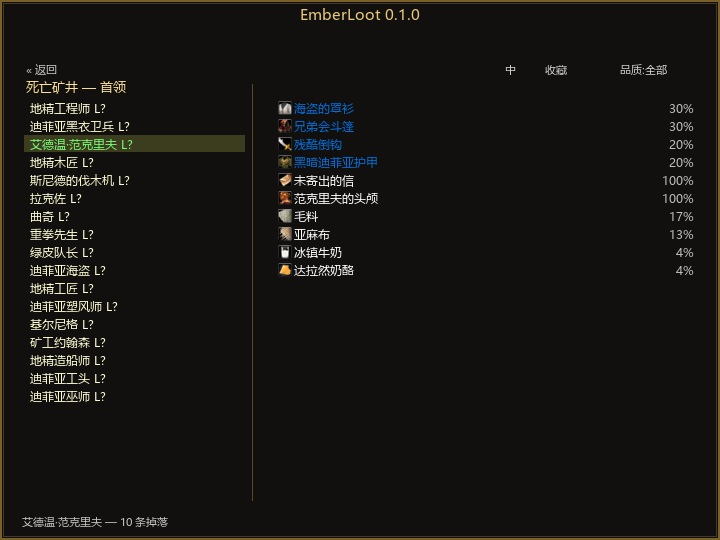

# EmberLoot

中文 | [English](README_EN.md)

**Emberveil 副本掉落浏览器**（AtlasLoot 式）· 适用于 Emberveil 客户端（WoW 1.12.1 模拟 / Lua 5.1 API）· 当前版本 0.2.0

## 功能

- **副本 → 首领 → 掕落表**三级浏览：内置 8 个已开放副本（血色、死亡矿井、黑石深渊、斯坦索姆、熔火之心、奥妮克希亚等，随官方数据库持续更新）、64 个首领/精英 + 8 个区域小怪掉落池、**3809 件物品 / 9256 条掉落记录**（中英双名）
- 物品按品质染色（粗糙→传说），图标 + 掉率 + 单组多选（一组N选1）标记 + 任务物品标记
- **物品属性 tooltip**：悬停即看——物品等级/需求等级、绑定类型、护甲/伤害/每秒伤害/攻速、属性与抗性、耐久、触发法术、套装、出售价格（0.2.0 起随包内嵌全量属性数据，无需游戏内缓存）
- **小地图按钮**：环绕小地图排布、可拖拽吸附，点击直接开关浏览器
- **搜索**：中英文名均可匹配；**品质过滤**（全部/优秀+/稀有+/史诗+）
- **收藏**：Shift+点击物品收藏，收藏页一键回看
- 聊天输入框打开时点击物品 = 插入物品链接
- **中英双语**：`/el zh` / `/el en` 一键切换，物品名两套数据随包内置
- 窗口可拖动，位置记忆；零第三方库

## 安装

1. 下载 `EmberLoot-0.2.0.zip` 并解压
2. 把 `EmberLoot` 整个文件夹放进 `...\Emberveil\live\Azeroth\Interface\AddOns\`
3. 重登游戏，聊天栏出现 `EmberLoot 0.2.0 — N 个副本 / M 件物品` 即成功

## 命令

| 命令 | 作用 |
|---|---|
| `/el` 或 `/emberloot` | 开关掉落浏览器 |
| `/el zh` / `/el en` | 切换界面语言 |
| `/el fav` | 打开并直接显示收藏 |

## 交互

- 左列：副本列表（玩家上限 + 首领数）→ 点进首领列表（带等级，`*` = 稀有精英/首领）
- 右列：物品表——点首领看该首领掉落；不点首领 = 整个副本聚合掉落表（按品质→掉率排序，标注掉落来源）
- Shift+点物品 = 收藏/取消；聊天框打开时点物品 = 插入链接

## 数据来源与更新

`tools/crawl.py` 离线采集 [database.emberveil.org](https://database.emberveil.org)（每页双语抓取，掉落行含掉率/分组/数量），生成压缩 Lua 表 `EmberLoot/data.lua`。服务器新增内容后重跑采集器即可增量更新数据。

## 许可

MIT License
